# Student-Information-Management-System
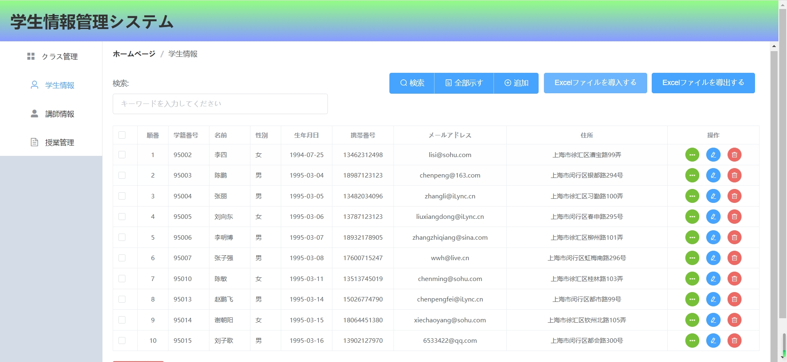
##
システム構成イメージ図：
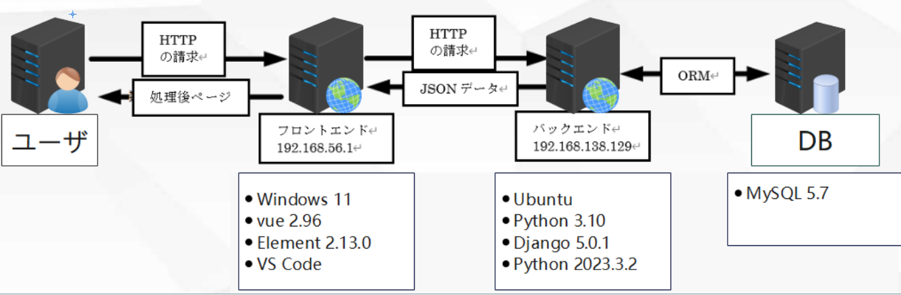
#
## 
以下のURLでこのシステム訪問可能
http://43.206.6.40:5500/index.html
本システムの利用方法：
##
1.実行環境の準備：
###
バックエンドファイルではVMware WorkstationでUbuntuあるいはWindows７以上の仮想環境で実装できます。フロントエンドファイルでは本環境Windows７以上でVScodeの環境で実装できます。まだバックエンドでMySQL5.7を用意が必要です。以下のコマンドで"StudentV4DB"という名前のデータベースを生成してください。
##
###
CREATE DATABASE StudentV4DB;
##
2.ソースコードのダンロード
#
[https://github.com/282207134/Student-Information-Management-System.git](https://github.com/282207134/Student-Information-Management-System.git)
##
##
3.ダンロードしたソースコードフォルダ中の/back end/StudentV4BE　をバックエンド、Student-Information-Management-System/front end/StudentV4FE　をフロントエンドの環境にコーピーてください。
##
4.VScodeでStudentV4FEフォルダを開いて、必要なプラグイン[Vue 3 Snippets]や[Live Server]をインストールしてください。
##

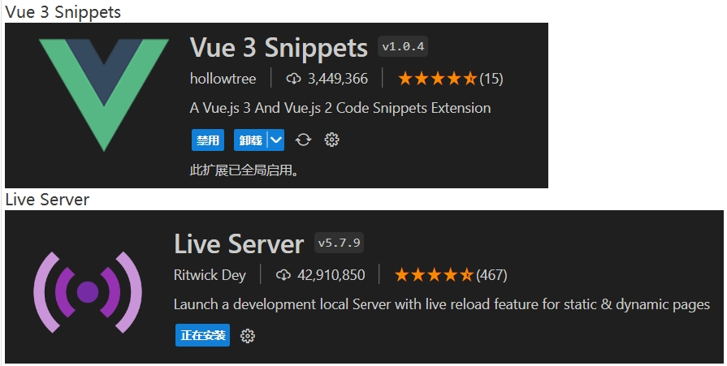
##
5.StudentV4FE\js\index.jsファイルの37行目を自分のバックエンドのIPアドレスを変更してください。
##
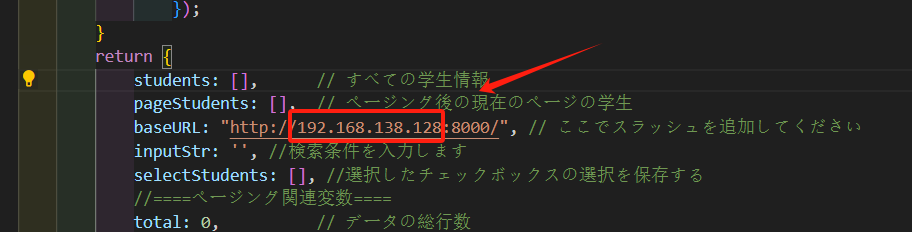
##
#
バックエンドではPyCharmでファイルで開いて、以下の操作をします。
##
6.StudentV4BE\StudentV4BE\settings.py ファイルの修正：
###
21行目で自分のバックエンドIPアドレスを変わります
#
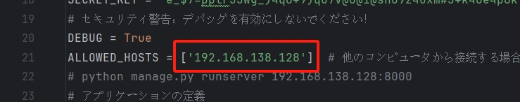
###
69行目からのデータベースを自分のように設定します。
##
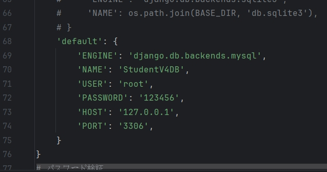

###
107行目は自分のフロントエンドのIPアドレスに変わります。
##
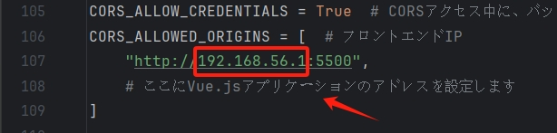
##
7.バックエンドで以下のライブラリをインストールしてください。
#
pip install pymysql
#
pip install django-cors-headers   
#
pip install cryptography
#
pip install openpyxl
#
windowの場合:
#
pip install mysqlclient
#
ubuntuの場合:
#
sudo apt-get update
#
sudo apt-get install python3-dev default-libmysqlclient-dev
##
8.バックエンドでローカルサーバーを起動します。
#
python manage.py runserver 192.168.138.128:8000

##
9.フロントエンドでVScode，index.htmlファイルを右クリックして、Open with Live Serverを左クリックしましたら、ブラウザが新しいページが出できます。

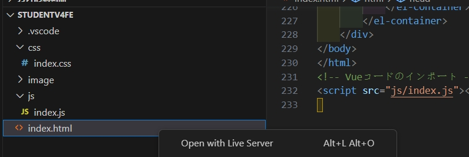
##
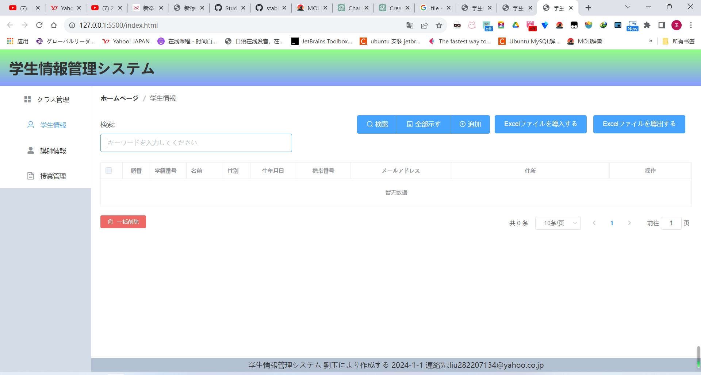

##
ここのアドレスが自分のフロントエンドIPアドレスを変わってくだい
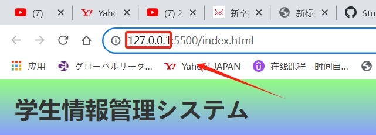
##
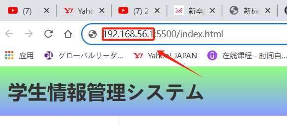 
##
そしたら、成功したメッセージが見えます。
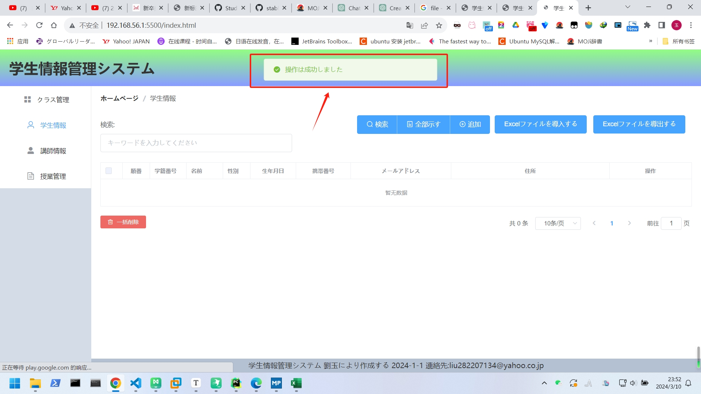
##
テスト用ファイルtestFile.xlsxを導入します。
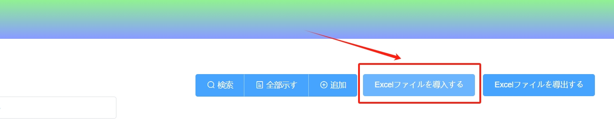
##
成功したメッセージ
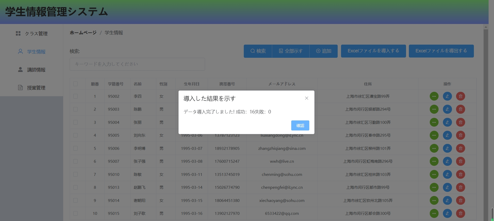
##
導入したデータが見えます。
#
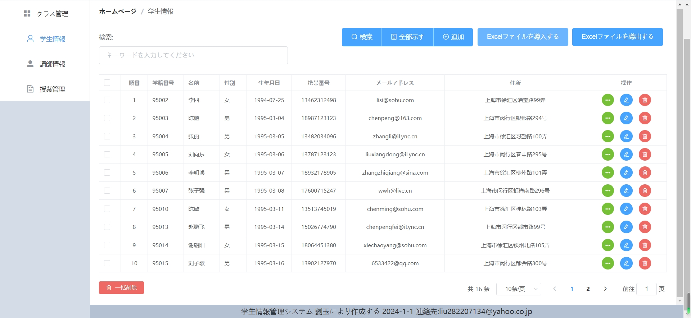

#
実現した機能を紹介いたします
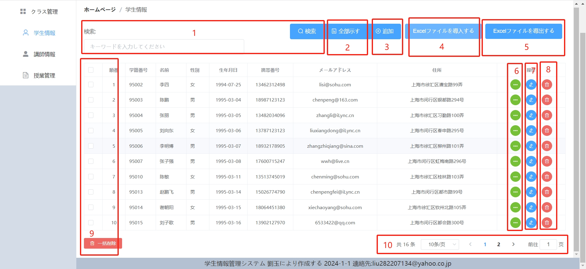
###
1.データを検索できる機能
###
2.全部データを示す機能
###
3.新しいデータを一つ追加できる機能
###
4.Excelファイル導入する機能
###
5.Excelファイル導出する機能
###
6.データを一つ照査の機能
###
7.データを一つ添削の機能
###
8.データを一つ削除の機能
###
9.データを多数選択し、削除できる機能
###
10.ページリング及びページをめくる機能
